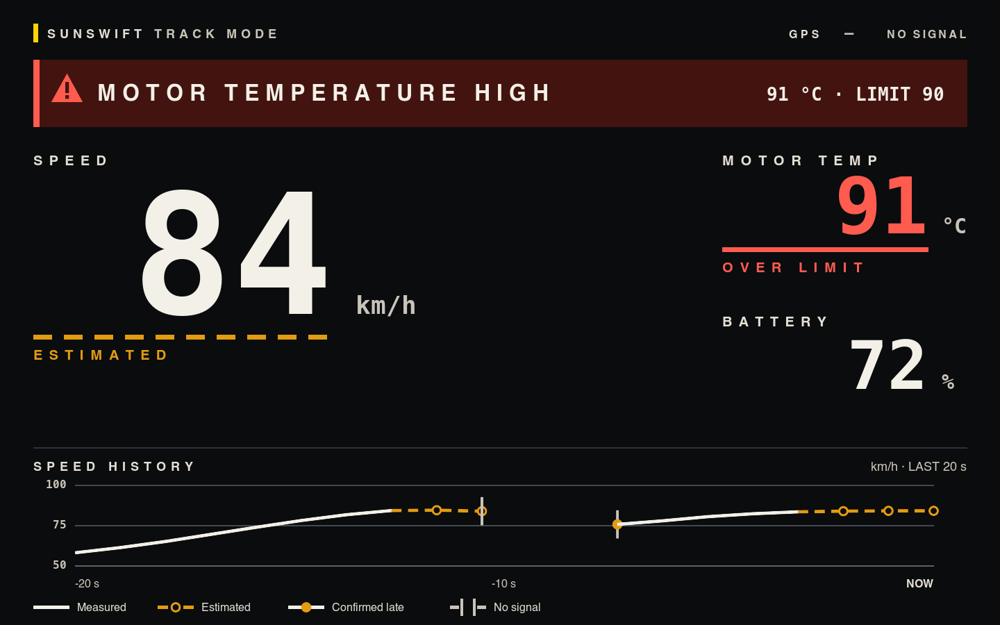

# Infotainment Engineer Aptitude Test

## Running it

Q1 and Q2 are independent packages; install in each

```
cd q1 && npm install && npm test    # 51 tests
npm run dev                         # dashboard and speed chart

cd q2 && npm install && npm test    # 40 tests
npm start                           # localhost:3000 redirects to Swagger UI at /docs
```

## Where to look

`assumptions.md` and `design_choices.md` carry the reasoning behind the submission, it contains what it assumes and cannot prove from the supplied data. `design_choices.md` also lists known limitations and what production would need.

For Q1, `q1/README.md` covers the cleaning approach and the approaches that were tried and dropped: alpha-beta filtering was built and measured before being rejected, and GPS-derived speed was investigated as a cross-check and rejected on the evidence. The data cleaning / extrapolation logic itself is in `q1/lib/normalise.js`. 

For Q2, `q2/app.js` holds the design comment and both endpoints. `q2/openapi.yaml` is the swagger contract, easiest read as the rendered page at `/docs`.

Q3 is `q3/a3.md`.

## Two notes

`q1/telemetry_sample.json` is unmodified. The app reads `q1/telemetry_overheat.json`, the same 24 rows plus a 12-sample temperature climb, because the supplied sample peaks at 76.9 °C and the `motorTemp > 90` warning would never fire against it. I added another dataset to visualise what that case would look like.

Q1 recovers what it can from bad data and Q2 rejects it. Q1 reads a recorded file where a rejected reading is lost permanently; Q2 is an ingest boundary where a producer sending the wrong type can be fixed. Both are argued in `design_choices.md`.

## Optional Q3 extra

`q3/track-mode-preview.png` is the Track Mode screen. `q3/figma-track-mode/` builds the editable Figma file with its component sets.

### Preview:


Figma link: 
https://www.figma.com/design/PMf5FtyT1uNXnz00RgqGkj/Untitled?node-id=1-2&t=aZSNyTFYNLc4501X-1
